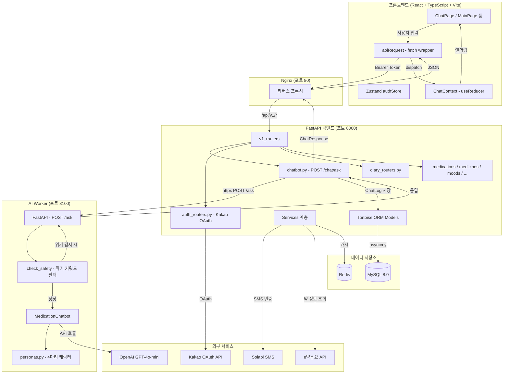

# DodakTalk (도닥톡) - 코드베이스 가이드

---

## 1. 프로젝트 한 줄 요약

사용자의 복약 정보와 대화 맥락을 기반으로, 강아지 캐릭터 페르소나가 건강 상담을 해주는 AI 챗봇 서비스.

---

## 2. 전체 아키텍처 다이어그램



**핵심 흐름 요약:**
- 사용자 메시지 -> Nginx -> FastAPI 백엔드 -> AI Worker(위기 필터 -> OpenAI) -> 응답 반환 + DB 저장

---

## 3. 폴더 및 파일 구조

```
AI_Health_final/
├── app/                          # FastAPI 백엔드
│   ├── main.py                   # FastAPI 앱 인스턴스, CORS, 라우터 등록
│   ├── core/
│   │   ├── config.py             # 환경변수 설정 (DB, JWT, Kakao, LLM 등)
│   │   ├── logger.py             # 로깅 유틸
│   │   └── memory_db.py          # 개발용 인메모리 저장소
│   ├── apis/v1/
│   │   ├── __init__.py           # ★ v1_routers - 모든 라우터 통합
│   │   ├── auth_routers.py       # 카카오 로그인, 토큰 갱신, 전화 인증
│   │   ├── chatbot.py            # ★ POST /chat/ask - AI Worker 호출 + ChatLog 저장
│   │   ├── user_routers.py       # 내 정보 조회/수정
│   │   ├── character_routers.py  # 캐릭터 목록/선택
│   │   ├── diary_routers.py      # 일기 CRUD, 챗봇 요약, 리포트
│   │   ├── medication_routers.py # 처방전 CRUD, 복약 로그
│   │   ├── medicine_routers.py   # 약 검색 (KFDA 연동)
│   │   ├── mood_routers.py       # 기분 기록
│   │   ├── appointment_routers.py# 병원 예약 관리
│   │   ├── home_routers.py       # 메인 홈 데이터 (오늘 기분/복약)
│   │   └── user_medication_routers.py # 사용자 약물 관리
│   ├── models/                   # Tortoise ORM 모델
│   │   ├── users.py              # User (카카오 연동, 전화번호)
│   │   ├── chat.py               # ★ ChatLog (대화 이력)
│   │   ├── character.py          # UserCharacter (1:1 캐릭터 연결)
│   │   ├── diary.py              # Diary (일기)
│   │   ├── mood.py               # Mood (기분 - 하루 4번)
│   │   ├── medication.py         # MedicationPrescription, MedicationLog
│   │   ├── medicine.py           # Medicine (약 DB)
│   │   ├── appointment.py        # Appointment (병원 예약)
│   │   ├── report.py             # Report (건강 리포트)
│   │   └── user_medication.py    # UserMedication (활성 약물)
│   ├── dtos/                     # Pydantic v2 요청/응답 DTO
│   │   ├── base.py               # BaseSerializerModel (from_attributes=True)
│   │   ├── auth.py               # 로그인/회원가입 DTO
│   │   ├── chat.py               # ChatRequest, ChatResponse
│   │   ├── character_dto.py      # 캐릭터 선택 DTO
│   │   ├── diary_dto.py          # 일기 관련 DTO
│   │   ├── diary_report_dto.py   # 챗봇 요약/리포트 DTO
│   │   ├── medication_dto.py     # 처방전/복약 DTO
│   │   ├── medicine_dto.py       # 약 검색 DTO
│   │   └── mood_dto.py           # 기분 기록 DTO
│   ├── services/                 # 비즈니스 로직
│   │   ├── auth.py               # AuthService (카카오 OAuth, 전화 인증)
│   │   ├── jwt.py                # JwtService (토큰 생성/검증)
│   │   ├── users.py              # UserManageService
│   │   ├── character_service.py  # CharacterService (4마리 캐릭터)
│   │   ├── llm_service.py        # ★ LlmService (대화 요약, 일기 변환)
│   │   ├── diary_report_service.py # DiaryReportService (일기, 리포트, OCR)
│   │   ├── medication_service.py # MedicationService
│   │   ├── medicine_service.py   # MedicineService (KFDA 연동)
│   │   ├── phone_auth.py         # PhoneAuthService (Solapi SMS)
│   │   └── ocr_service.py        # OcrService (처방전 OCR)
│   ├── dependencies/
│   │   ├── security.py           # ★ get_request_user() - JWT 인증 의존성
│   │   └── redis.py              # Redis 연결
│   ├── repositories/
│   │   └── user_repository.py    # UserRepository (DB 쿼리 계층)
│   ├── utils/
│   │   ├── common.py             # 전화번호 정규화 등
│   │   ├── security.py           # 비밀번호 해싱
│   │   └── jwt/                  # JWT 토큰 클래스 (Access, Refresh, Temp)
│   ├── validators/               # 입력 검증 (전화번호, 생년월일)
│   └── db/
│       ├── databases.py          # ★ Tortoise ORM 초기화 (asyncmy + MySQL)
│       └── migrations/           # Aerich 마이그레이션 파일
│
├── ai_worker/                    # AI 추론 서비스 (별도 FastAPI 인스턴스)
│   ├── main.py                   # ★ POST /ask 엔드포인트, MedicationChatbot 로드
│   ├── core/
│   │   └── config.py             # AI Worker 설정 (타임존)
│   └── tasks/
│       ├── chatbot_engine.py     # ★ MedicationChatbot 클래스, 위기 키워드 필터
│       ├── personas.py           # ★ 4마리 강아지 페르소나 시스템 프롬프트
│       ├── kfda_client.py        # KFDA e약은요 API 클라이언트
│       └── rag_service.py        # RAG 서비스 (미구현 플레이스홀더)
│
├── frontend/                     # React 프론트엔드
│   ├── src/
│   │   ├── main.tsx              # React 앱 진입점
│   │   ├── App.tsx               # 앱 루트 (토큰 갱신, RouterProvider)
│   │   ├── router/index.tsx      # ★ 라우트 정의 (AuthRequired 래핑)
│   │   ├── api/
│   │   │   ├── client.ts         # ★ apiRequest() - 인증 헤더/401 자동 갱신
│   │   │   ├── chatApi.ts        # sendMessage() - POST /chat/ask
│   │   │   ├── diary.ts          # 일기/요약 API
│   │   │   └── ...               # auth, users, medicines, moods 등
│   │   ├── store/
│   │   │   └── authStore.ts      # ★ Zustand - accessToken, userId, selectedCharacter
│   │   ├── context/
│   │   │   └── ChatContext.tsx    # ★ 채팅 상태 관리 (useReducer + Context)
│   │   ├── pages/
│   │   │   ├── ChatPage.tsx      # ★ 채팅 메인 화면
│   │   │   ├── MainPage.tsx      # 메인 대시보드
│   │   │   ├── LoginPage.tsx     # 카카오 로그인
│   │   │   ├── CharacterSelectPage.tsx # 캐릭터 선택 (온보딩)
│   │   │   ├── DiaryDetailPage.tsx # 일기 상세 + 챗봇 요약
│   │   │   └── ...               # Signup, Report, Mood, Appointment, MyPage
│   │   ├── components/
│   │   │   ├── ChatBubble.tsx    # 말풍선 (유저/AI, 경고 레벨별 색상)
│   │   │   ├── ChatInput.tsx     # 메시지 입력창 + 전송 버튼
│   │   │   ├── ChipMenu.tsx      # 복약 빠른선택 칩
│   │   │   ├── Header.tsx        # 채팅 헤더 (뒤로, 도닥톡, 메뉴)
│   │   │   ├── HamburgerMenu.tsx # 슬라이드 메뉴
│   │   │   ├── RedAlertOverlay.tsx # 위기 감지 시 전체화면 오버레이
│   │   │   ├── TypingIndicator.tsx # AI 응답 로딩 애니메이션
│   │   │   ├── ProtectedRoute.tsx  # AuthRequired, SignupRequired
│   │   │   └── ...               # Button, Calendar, Cards, CommonUI 등
│   │   ├── types/                # TypeScript 타입 정의
│   │   ├── constants/theme.ts    # 디자인 토큰 (색상, 폰트)
│   │   └── utils/date.ts         # 날짜 포매팅
│   ├── vite.config.ts            # Vite 설정 (dev proxy → localhost:8000)
│   └── Dockerfile                # 멀티스테이지 빌드 (node:20 → dist)
│
├── docker-compose.yml            # ★ 전체 서비스 오케스트레이션
├── docker-compose.prod.yml       # 프로덕션용 compose
├── nginx/default.conf            # Nginx 리버스 프록시 설정
├── pyproject.toml                # Python 의존성 (app/ai/dev 그룹 분리)
├── tests/                        # 테스트 코드
└── envs/                         # 환경변수 파일
```

> ★ 표시는 코드 흐름을 이해하는 데 핵심적인 파일입니다.

---

## 4. 핵심 모듈 상세 설명

### 4.1 AI Worker - `MedicationChatbot` (ai_worker/tasks/chatbot_engine.py)

| 항목 | 내용 |
|------|------|
| **역할** | 사용자 메시지를 받아 위기 키워드 필터링 후 OpenAI API로 답변 생성 |
| **입력** | `user_message: str`, `meds: list[str]`, `user_note: str`, `character_id: int` |
| **출력** | `{"answer", "warning_level", "red_alert", "alert_type"}` |
| **호출하는 쪽** | `ai_worker/main.py` (POST /ask 핸들러) |
| **호출되는 쪽** | `check_safety()` (위기 필터), `get_persona_prompt()` (페르소나), `AsyncOpenAI` (GPT API) |

```
메시지 수신 → check_safety() → 위기감지? → Yes → 위기응답 즉시 반환 (LLM 생략)
                                           → No  → 페르소나 프롬프트 + OpenAI 호출 → 응답 반환
```

### 4.2 위기 키워드 필터 - `check_safety()` (ai_worker/tasks/chatbot_engine.py)

| 항목 | 내용 |
|------|------|
| **역할** | 사용자 메시지에서 자살/자해/약물과다 관련 키워드를 정규식으로 탐지 |
| **입력** | `text: str` (사용자 메시지) |
| **출력** | `{"alert_type": "Direct"/"Indirect"/"Substance", "keyword": str}` 또는 `None` |
| **호출하는 쪽** | `MedicationChatbot.get_response()` |

- Direct: 자살, 죽고 싶, 자해 등 직접적 표현
- Indirect: 사라지고 싶, 삶이 의미 없 등 간접적 표현
- Substance: 약 많이 먹, 약물 과다 등 약물 남용 표현

### 4.3 캐릭터 페르소나 - `personas.py` (ai_worker/tasks/personas.py)

| 항목 | 내용 |
|------|------|
| **역할** | 4마리 강아지 캐릭터별 OpenAI 시스템 프롬프트 제공 |
| **입력** | `character_id: int` (1~4) |
| **출력** | `str` (시스템 프롬프트 전문) |
| **호출하는 쪽** | `MedicationChatbot.get_response()` |

| ID | 이름 | 성격 |
|----|------|------|
| 1 | 참깨 | 걱정을 먼저 알아채고 보살펴주는 친구 |
| 2 | 들깨 | 하나부터 열까지 차근차근 알려주는 친구 |
| 3 | 흑깨 | 밝고 긍정적이면서 웃음을 건네는 친구 |
| 4 | 통깨 | 귀엽고 공감 리액션으로 기분을 밝혀주는 친구 |

### 4.4 백엔드 챗봇 라우터 - `chatbot.py` (app/apis/v1/chatbot.py)

| 항목 | 내용 |
|------|------|
| **역할** | 프론트엔드 요청을 AI Worker에 중계하고, 대화 이력을 DB에 저장 |
| **입력** | `ChatRequest` (user_id, message, medication_list, user_note, character_id) |
| **출력** | `ChatResponse` (answer, warning_level, red_alert, alert_type) |
| **호출하는 쪽** | 프론트엔드 `chatApi.ts` → `POST /api/v1/chat/ask` |
| **호출되는 쪽** | AI Worker (`httpx POST http://ai-worker:8100/ask`), `ChatLog.create()` |

### 4.5 API 클라이언트 - `client.ts` (frontend/src/api/client.ts)

| 항목 | 내용 |
|------|------|
| **역할** | 모든 API 호출의 공통 래퍼. 인증 헤더 자동 주입, 401 시 토큰 갱신 후 재시도 |
| **입력** | `path: string`, `options: RequestInit` |
| **출력** | `Promise<T>` (제네릭 JSON 응답) |
| **호출하는 쪽** | `chatApi.ts`, `diary.ts`, `users.ts` 등 모든 API 모듈 |
| **호출되는 쪽** | `fetch()`, `refreshAccessToken()`, `useAuthStore` |

핵심 로직:
1. localStorage에서 access_token 가져와 Authorization 헤더 설정
2. `credentials: "include"`로 httpOnly 쿠키(refresh_token) 포함
3. 401 응답 시 → `/auth/token/refresh` 호출 → 새 토큰으로 재시도
4. 재시도도 실패 시 → `clearAuth()` 호출 → 로그인 페이지로

### 4.6 채팅 상태 관리 - `ChatContext.tsx` (frontend/src/context/ChatContext.tsx)

| 항목 | 내용 |
|------|------|
| **역할** | 채팅 메시지 배열, 로딩 상태, 위기 알림 상태를 useReducer로 관리 |
| **상태** | `messages[]`, `isLoading`, `showRedAlert`, `redAlertMessage`, `isMenuOpen`, `medicationList` |
| **액션** | `ADD_USER_MESSAGE`, `ADD_AI_MESSAGE`, `SET_LOADING`, `SHOW_RED_ALERT`, `HIDE_RED_ALERT`, `TOGGLE_MENU`, `SET_MEDICATIONS` |
| **호출하는 쪽** | `ChatPage.tsx`에서 `useChatState()`, `useChatDispatch()` 훅으로 사용 |

### 4.7 인증 스토어 - `authStore.ts` (frontend/src/store/authStore.ts)

| 항목 | 내용 |
|------|------|
| **역할** | 전역 인증 상태 관리 (Zustand). localStorage에 자동 동기화 |
| **상태** | `accessToken`, `userId`, `selectedCharacter` |
| **호출하는 쪽** | `ProtectedRoute`, `client.ts`, `ChatPage`, `MainPage` 등 거의 모든 곳 |

### 4.8 LLM 서비스 - `llm_service.py` (app/services/llm_service.py)

| 항목 | 내용 |
|------|------|
| **역할** | 챗봇 대화를 일기로 변환, 대화 요약, 리포트 요약 생성 |
| **주요 메서드** | `summarize_chat_as_diary()`, `summarize_chat()`, `summarize_report()`, `generate_title()` |
| **호출하는 쪽** | `DiaryReportService.get_chatbot_summary()` |
| **호출되는 쪽** | OpenAI API (httpx) 또는 stub 폴백 |
| **provider 전환** | 환경변수 `LLM_PROVIDER`가 `"openai"`이면 실제 API 호출, 아니면 stub 반환 |

---

## 5. 데이터 흐름

### 5.1 사용자가 채팅 메시지를 보낼 때

```
① ChatPage에서 사용자가 메시지 입력 후 전송 버튼 클릭

② ChatInput.onSend() 호출
   → dispatch({ type: "ADD_USER_MESSAGE", payload: text })
   → dispatch({ type: "SET_LOADING", payload: true })

③ chatApi.sendMessage() 호출
   → apiRequest<ChatResponse>("/chat/ask", { method: "POST", body: JSON.stringify({
       user_id, message, medication_list, character_id
     })})

④ apiRequest()가 Bearer 토큰을 헤더에 첨부하여 fetch 실행
   → GET /api/v1/chat/ask → Nginx → FastAPI

⑤ chatbot.py의 ask_question() 핸들러 실행
   → httpx로 AI Worker (http://ai-worker:8100/ask) 에 POST 요청

⑥ AI Worker main.py가 요청 수신
   → MedicationChatbot.get_response() 호출

⑦ check_safety()로 위기 키워드 검사
   → 감지 시: 위기 응답 즉시 반환 (OpenAI 호출 생략)
   → 미감지 시: 다음 단계로

⑧ get_persona_prompt(character_id)로 선택된 캐릭터의 시스템 프롬프트 로드

⑨ AsyncOpenAI.chat.completions.create() 호출
   → system: 캐릭터 페르소나 프롬프트
   → user: "복용 중인 약: ... \n질문: {사용자 메시지}"

⑩ OpenAI 응답을 파싱하여 answer + warning_level + red_alert 구성 → 반환

⑪ chatbot.py가 AI Worker 응답 수신
   → ChatLog.create()로 DB에 대화 이력 저장
   → ChatResponse로 변환하여 프론트엔드에 반환

⑫ apiRequest()가 JSON 응답 수신
   → dispatch({ type: "ADD_AI_MESSAGE", payload: response })

⑬ ChatPage가 리렌더링
   → ChatBubble 컴포넌트로 AI 메시지 표시
   → red_alert가 true이면 RedAlertOverlay 전체화면 표시
```

### 5.2 카카오 로그인 흐름

```
① LoginPage에서 카카오 로그인 버튼 클릭 → 카카오 OAuth 페이지로 리다이렉트

② 사용자가 카카오에서 인증 → /auth/kakao/callback?code=xxx 로 리다이렉트

③ KakaoCallbackPage가 code를 추출
   → POST /api/v1/auth/kakao { code } 전송

④ AuthService가 카카오 API로 토큰 교환 → 사용자 정보 조회
   → 기존 유저: access_token + refresh_token(httpOnly 쿠키) 반환
   → 신규 유저: temp_token 반환 → /signup 페이지로 이동

⑤ authStore에 accessToken, userId 저장
   → /main 또는 /character-select 페이지로 이동
```

### 5.3 챗봇 대화 일기 요약 흐름

```
① DiaryDetailPage에서 "요약하기" 버튼 클릭

② GET /api/v1/diary/{date}/chatbot/summary 호출

③ DiaryReportService.get_chatbot_summary() 실행
   → ChatLog 테이블에서 해당 날짜의 대화 이력 조회 (user_id + date)
   → "사용자: {message}\n챗봇: {response}" 형태로 텍스트 구성

④ LlmService.summarize_chat_as_diary() 호출
   → OpenAI에 일기체 변환 프롬프트 전송
   → {"title": "...", "content": "..."} JSON 반환

⑤ 프론트엔드에서 제목 + 내용 표시, 저장 버튼 제공
```

---

## 6. 팀원을 위한 주의사항

### 건드리면 안 되는 부분

| 파일/모듈 | 이유 |
|-----------|------|
| `app/dependencies/security.py` | 모든 인증 라우터가 의존. 변경 시 전체 API 인증 깨짐 |
| `app/utils/jwt/` 전체 | 토큰 구조 변경 시 기존 사용자 세션 전부 무효화 |
| `CRISIS_KEYWORDS` (chatbot_engine.py) | 삭제하면 안전장치 해제. 추가만 가능 |
| `apiRequest()` (client.ts) | 모든 API 호출이 이 함수를 경유. 시그니처 변경 시 전체 영향 |
| `docker-compose.yml` 네트워크 설정 | 서비스 간 통신(ai-worker:8100 등)이 네트워크명에 의존 |

### 확장/수정하기 좋은 포인트

| 포인트 | 설명 |
|--------|------|
| `personas.py` | 새 캐릭터 추가: `DOG_PERSONAS` 딕셔너리에 항목 추가하면 됨 |
| `CRISIS_KEYWORDS` | 새 키워드 추가: 해당 카테고리 리스트에 문자열 추가 |
| `llm_service.py` | 프롬프트 튜닝: `summarize_chat_as_diary()` 내 prompt 문자열 수정 |
| `kfda_client.py` | e약은요 API 연동: API 키 설정 후 바로 사용 가능한 구조 |
| `rag_service.py` | RAG 구현: 플레이스홀더가 이미 있어 Vector DB 연결만 하면 됨 |
| `frontend/src/pages/` | 새 페이지 추가: 페이지 생성 후 `router/index.tsx`에 경로 등록 |
| `frontend/src/api/` | 새 API 연동: `apiRequest()` 기반으로 함수 추가 |

### [확인 필요] 불명확한 부분

| 항목 | 상태 |
|------|------|
| `chatbot.py`에서 `request.user_id`를 클라이언트가 직접 전송 | JWT에서 추출하지 않고 클라이언트 값을 신뢰하는 구조. 보안 검토 필요 |
| `home_routers.py`의 인메모리 저장소 | `memory_db.py` 사용 중. 프로덕션에서는 실제 DB 쿼리로 교체 필요 |
| `rag_service.py` | 플레이스홀더만 존재. Vector DB 선택(ChromaDB/FAISS) 및 데이터 적재 미완 |
| LLM Provider 전환 | `LLM_PROVIDER` 환경변수 미설정 시 stub 모드로 동작. 프로덕션 배포 전 확인 필요 |
| `OCR_PROVIDER` | stub/http 전환 가능하나 실제 OCR 서비스 연동 상태 불명확 |

### 개발 환경 참고

- **백엔드 실행**: `uv run uvicorn app.main:app --reload --port 8000`
- **AI Worker 실행**: `uv run uvicorn ai_worker.main:app --port 8100`
- **프론트엔드 실행**: `cd frontend && npm run dev` (Vite dev server, 포트 5173)
- **DB 마이그레이션**: `uv run aerich migrate` → `uv run aerich upgrade`
- **Docker 전체 실행**: `docker compose up --build`
- **API 문서**: `http://localhost:8000/api/docs` (Swagger UI)
