# DodakTalk — AI 약물 상담 헬스케어 플랫폼

처방전 OCR 인식, 약물 상호작용 검사, AI 챗봇 상담을 통합한 헬스케어 서비스입니다.
사용자가 복용 중인 약물을 등록하면, LangGraph 기반 ReAct Agent가 FAISS·Neo4j·ChromaDB를 활용하여 근거 기반의 약물 안전 정보를 실시간으로 제공합니다.

🌐 **서비스 주소**: [dodactalk.site](https://dodactalk.site) | **API 문서**: [api.dodactalk.site/api/docs](https://api.dodactalk.site/api/docs)

---

## 왜 만들었는가

"이 서비스가 누구에게 가장 필요할까?"라는 질문에서 출발했습니다.

복약 관리가 가장 절실한 대상을 찾다가 **양극성 장애 환자**에 주목했습니다. 양극성 장애는 호전 반응을 체감하기 어려운 특성상 복약 순응률이 특히 낮습니다. 우영섭·박원명의 논문 *양극성 장애의 경과와 치료 순응도의 개선*에 따르면, **양극성 장애 환자의 53.9%가 예방적 약물 복용을 중단**하며, 그 중 **43.2%는 치료 시작 후 6개월 이내에 약을 끊습니다.** 꾸준히 복약해야 효과를 볼 수 있는 질환인데, 절반 이상이 중도에 포기하는 셈입니다.

이 문제를 단순한 알림 앱으로는 해결할 수 없다고 판단했습니다. 복약을 지속하려면 두 가지가 필요합니다. **"내가 왜 이 약을 먹어야 하는지" 스스로 납득하는 경험**, 그리고 **"이 약이 내 몸에서 어떻게 작용하는지" 언제든 물어볼 수 있는 창구**입니다.

그래서 네 가지 기능을 하나의 흐름으로 연결했습니다.

```
복약 알림 → 기분 체크 & 일기 작성 → AI 감정 리포트
                                         ↕
                        챗봇 상담 (내 약에 대해 더 깊이 알기)
```

- **복약 알림**: 하루 4회(아침·점심·저녁·취침 전) 복약 시간을 놓치지 않도록 SMS로 알립니다.
- **기분 체크 & 일기**: 매일 기분을 기록하고 일기를 작성하면 LLM이 감정 변화를 추적하여 의료진에게 전달할 수 있는 객관적 리포트를 생성합니다.
- **AI 챗봇 상담**: 페르소나를 선택할 수 있는 챗봇이 내가 복용 중인 약의 효능·용법·부작용·금기사항은 물론, 다른 약물이나 음식과의 상호작용까지 쉬운 말로 설명해줍니다. 복약하다 생기는 궁금증을 다음 진료까지 미루지 않아도 됩니다.

약을 먹는 행위가 자신의 상태 변화를 확인하고 이해하는 경험과 연결될 때, 복약은 의무가 아니라 자기 관리의 루틴이 될 수 있다고 생각했습니다.

DodakTalk은 **복약 알림 + 감정 기록 + AI 약물 상담**을 통합하여, 환자가 스스로 자신의 건강을 관리하는 선순환 구조를 만드는 것을 목표로 합니다.

---

## 화면 미리보기

### 온보딩 & 인증

<table>
  <tr>
    <td align="center">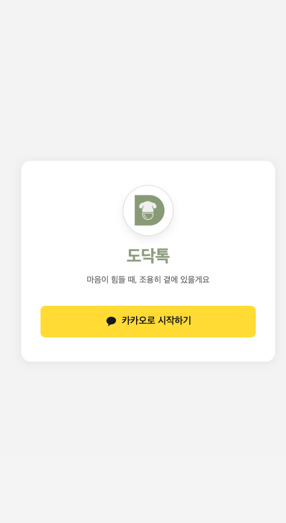<br/><sub>카카오 로그인</sub></td>
    <td align="center">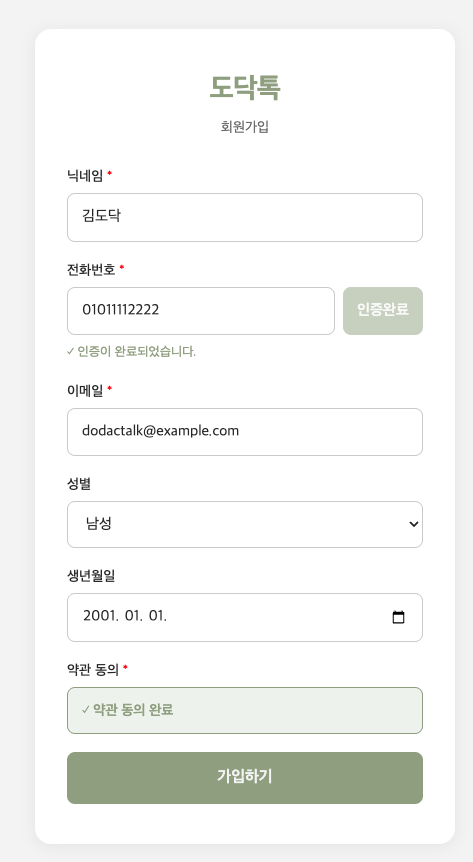<br/><sub>회원가입 (SMS 인증)</sub></td>
    <td align="center">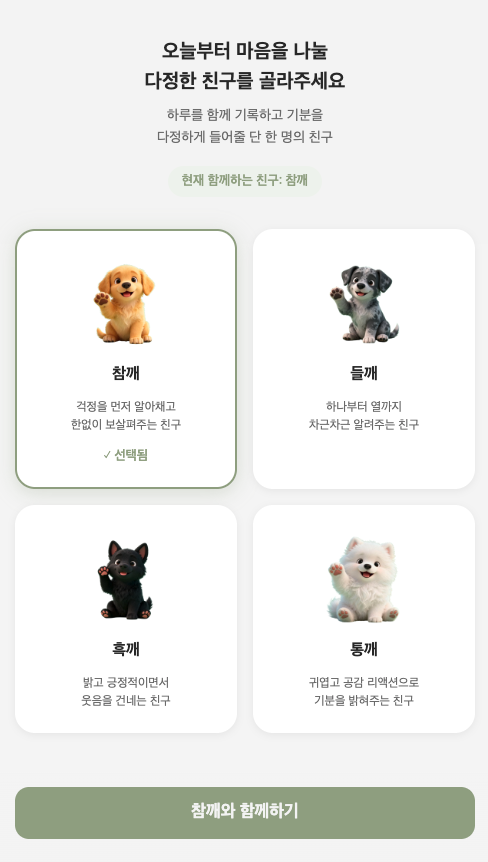<br/><sub>페르소나 선택</sub></td>
  </tr>
</table>

### 홈 — 온보딩 코치마크

처음 접속한 사용자에게 주요 기능을 단계별로 안내합니다.

<div>
  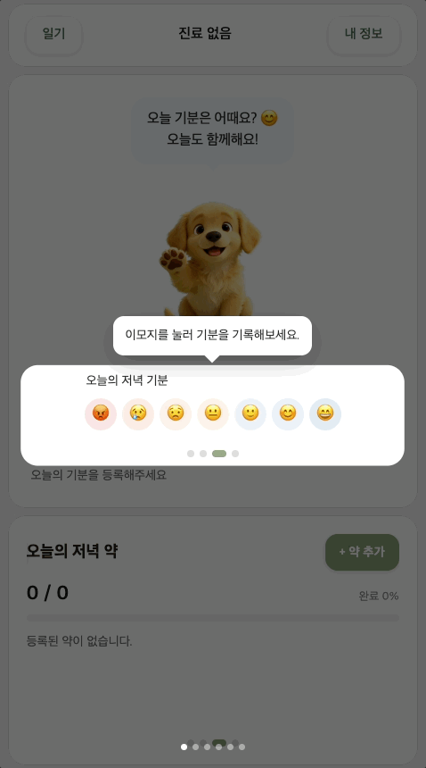<br/>
  <sub>홈 — 온보딩 코치마크</sub>
</div>

### 복약 관리 & OCR

<table>
  <tr>
    <td align="center">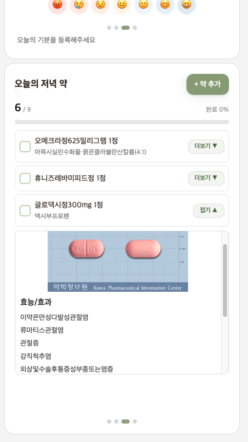<br/><sub>복약 체크 + 약 상세</sub></td>
    <td align="center">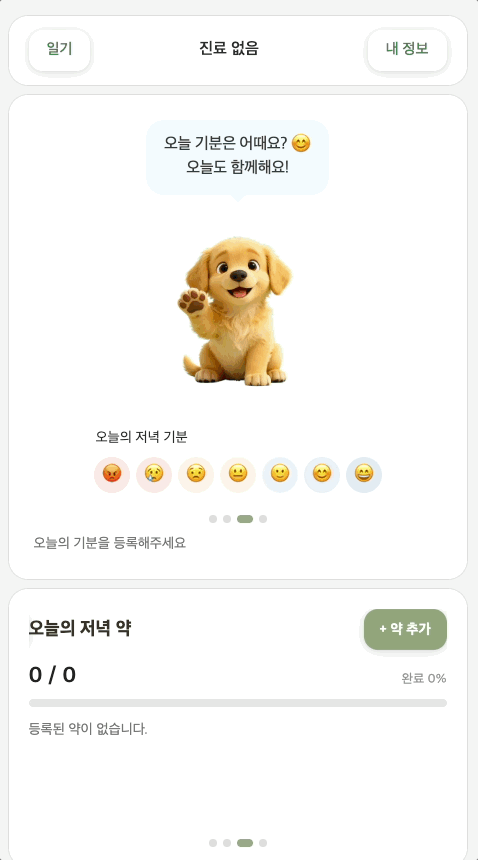<br/><sub>약 봉투 OCR 인식</sub></td>
  </tr>
</table>

### AI 챗봇 & 기록

<table>
  <tr>
    <td align="center">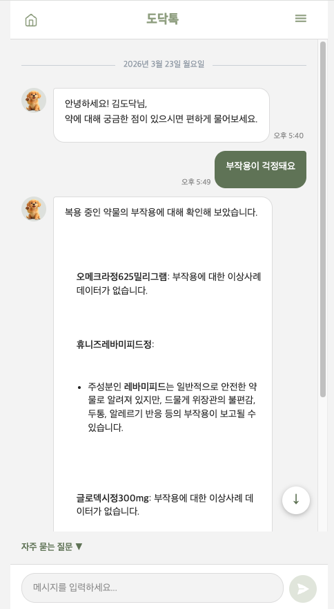<br/><sub>AI 챗봇 — 부작용 상담</sub></td>
    <td align="center">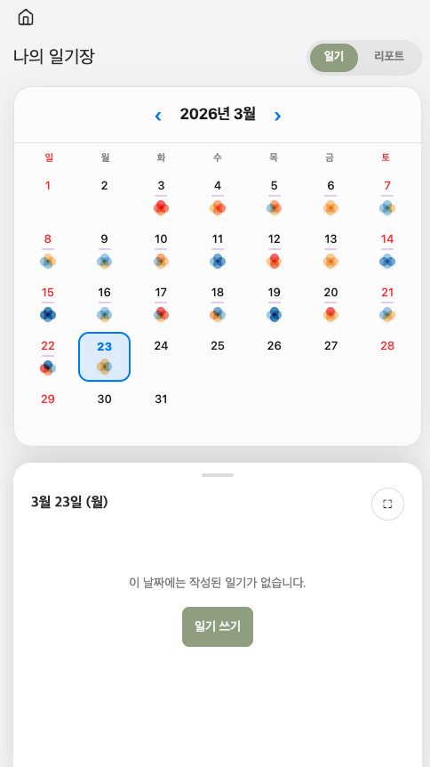<br/><sub>일기장 — 기분 캘린더</sub></td>
    <td align="center">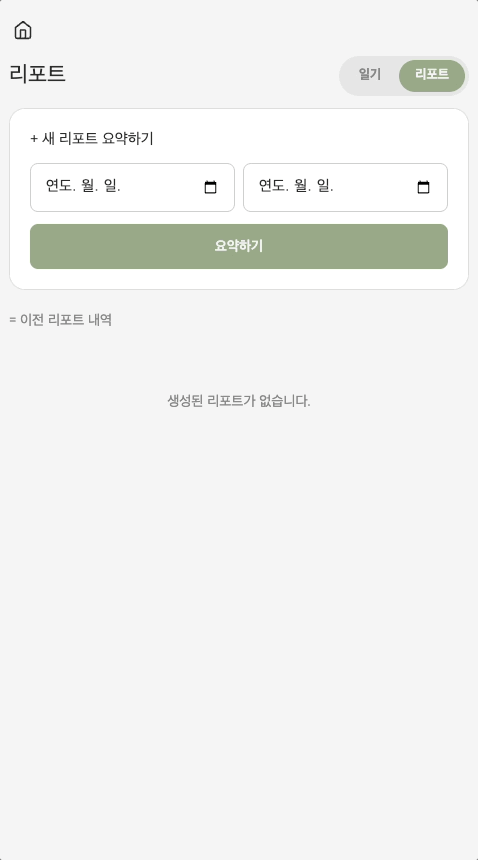<br/><sub>AI 감정 리포트</sub></td>
  </tr>
</table>

---

## 주요 기능

| 기능                   | 설명                                                                                                                    |
| ---------------------- | ----------------------------------------------------------------------------------------------------------------------- |
| AI 약물 상담 챗봇      | LangGraph ReAct Agent + GPT-4o-mini 기반. 12종 도구를 자동 선택하여 약물 효능·용법·상호작용·DUR 안전정보를 검색 후 응답 |
| 처방전 OCR             | Clova OCR로 처방전 이미지에서 약품명·투약량·횟수·일수를 자동 파싱. 8가지 레이아웃 패턴 지원                             |
| 약물 상호작용 검사     | Neo4j 지식그래프에서 성분 간 DANGER/CAUTION 관계를 교차 검사. 음식-약물 상호작용 포함                                   |
| DUR 안전정보 검색      | 병용금기·임부금기·노인주의·용량주의 등 식약처 DUR 데이터를 FAISS 벡터 검색으로 제공                                     |
| RAG 파이프라인         | HyDE 가설 생성 → ChromaDB 벡터 검색 Top-20 → Cross-Encoder Re-ranking → Top-5                                           |
| 복약 알림              | APScheduler + Redis 분산 락 기반 SMS 알림 (Solapi 연동). 60초 주기 스케줄 체크                                          |
| 위기 감지 2중 안전장치 | 1단계 Regex 키워드 매칭(LLM 호출 전 차단) + 2단계 LLM Structured Output 판단                                            |
| 카카오 OAuth 로그인    | JWT Access/Refresh Token 기반 인증. 쿠키 보안 설정 지원                                                                 |

### AI 약물 상담 챗봇 — 12종 도구 상세

LangGraph ReAct Agent가 질문 패턴을 분석하여 아래 12종 도구 중 필요한 것을 자동으로 선택·조합합니다.

| 도구                           | 설명                                                                         |
| ------------------------------ | ---------------------------------------------------------------------------- |
| `search_drug_info`             | 약물 효능·용법·용량·이상반응·외형(색상·각인·모양) 검색                       |
| `search_safety`                | DUR 안전정보 검색 — 병용금기·임부금기·노인주의·용량주의                      |
| `search_disease`               | 질환명으로 ICD 상병분류기호(상병코드) 검색                                   |
| `search_drug_meta`             | 브랜드명↔성분명 매핑, ATC 약효군 분류, 마약류·희귀의약품 여부 조회           |
| `lookup_adverse`               | 이상사례보고 데이터에서 성분명으로 부작용 코드 조회                          |
| `search_food_drug_sync`        | 음식-약물 상호작용 검색 (술·자몽·우유 등)                                    |
| `search_rag_sync`              | ChromaDB 기반 의학 가이드라인 벡터 검색                                      |
| `get_drug_interactions_sync`   | Neo4j에서 약물 상호작용 정보 조회                                            |
| `query_knowledge_graph`        | Neo4j 지식그래프에서 특정 약물-사용자 복용약 간 DANGER/CAUTION 상호작용 검색 |
| `check_all_drug_combinations`  | 사용자 복용약 전체 목록의 상호작용 교차 검사                                 |
| `get_user_medicines_sync`      | DB에서 사용자의 복용약 목록 및 복용 스케줄 조회                              |
| `get_medication_schedule_sync` | 오늘 복용 스케줄 조회 — 복용 예정·완료·다음 복용 시간 안내                   |

### RAG 파이프라인 — HyDE란?

일반적인 RAG는 사용자 질문을 그대로 벡터로 변환해 검색합니다. 그러나 "이 약 임산부가 먹어도 돼?"처럼 짧고 구어체인 질문은 의학 문서의 문체와 거리가 멀어 검색 품질이 떨어집니다.

**HyDE(Hypothetical Document Embeddings)** 는 이 문제를 해결하기 위해, 질문에 대한 **가상의 이상적인 답변 문서를 LLM으로 먼저 생성**한 뒤 그 문서를 벡터로 변환해 검색합니다. 실제 답변이 아니라 검색을 잘 하기 위한 가설 문서이기 때문에 사실 여부는 중요하지 않으며, 검색 정확도를 높이는 것이 목적입니다.

```
사용자 질문
    ↓
LLM으로 가상 답변 문서 생성 (HyDE)
    ↓
가상 문서를 벡터로 변환 → ChromaDB 검색 Top-20
    ↓
Cross-Encoder Re-ranking → Top-5 최종 컨텍스트
    ↓
GPT-4o-mini 최종 답변 생성
```

---

## 데이터 규모

### FAISS 벡터 인덱스

| 인덱스           | 벡터 수        | 설명                                    |
| ---------------- | -------------- | --------------------------------------- |
| `drug_info`      | 69,516건       | 의약품 상세 정보 (효능, 용법, 주의사항) |
| `disease`        | 72,701건       | 질병 정보                               |
| `safety`         | 29,053건       | 안전성 정보 (DUR 기반)                  |
| `drug_meta`      | 41,022건       | 의약품 외형/각인 정보 (낱알식별)        |
| `food_drug`      | 4,627건        | 식품-약물 상호작용                      |
| `adverse_lookup` | 29,098건       | 이상반응 룩업 테이블                    |
| **합계**         | **~246,000건** |                                         |

### Neo4j 지식그래프

| 항목                | 수량                              |
| ------------------- | --------------------------------- |
| Drug 노드           | 36개 (정신과 약물 중심)           |
| Component 노드      | 36개                              |
| Category 노드       | 13개                              |
| INTERACTS_WITH 엣지 | 104개 (DANGER 62개, CAUTION 42개) |
| HAS_COMPONENT 엣지  | 36개                              |
| BELONGS_TO 엣지     | 36개                              |

### ChromaDB (RAG 문서)

| 항목       | 내용                      |
| ---------- | ------------------------- |
| Collection | `dur_safety`              |
| Embeddings | 9,747건                   |
| Source     | DUR 안전성 문서 (8개 CSV) |

### 원본 데이터 (식약처)

| 파일                 | 레코드 수    |
| -------------------- | ------------ |
| e약은요 (의약품정보) | 4,729건      |
| 낱알식별정보         | 27,707건     |
| DUR 병용금기         | 1,742건      |
| DUR 임부금기         | 1,407건      |
| DUR 용량주의         | 651건        |
| DUR 효능군중복       | 375건        |
| DUR 특정연령대금기   | 227건        |
| DUR 노인주의         | 107건        |
| DUR 투여기간주의     | 95건         |
| DUR 첨가제주의       | 19건         |
| **DUR 합계**         | **~4,630건** |

---

## 기술 스택

### Backend

| 구분          | 기술                                                                    |
| ------------- | ----------------------------------------------------------------------- |
| Framework     | FastAPI, Uvicorn                                                        |
| ORM / DB      | Tortoise ORM (asyncmy), MySQL 8.0, Aerich (마이그레이션)                |
| 그래프 DB     | Neo4j 5.18 (약물-성분-상호작용 지식그래프)                              |
| 벡터 검색     | FAISS (약물·질병·DUR), ChromaDB (의학 가이드라인 RAG)                   |
| AI / LLM      | LangGraph ReAct Agent, LangChain, OpenAI GPT-4o-mini                    |
| 임베딩        | OpenAI text-embedding-ada-002 (FAISS), ko-sroberta-multitask (ChromaDB) |
| OCR           | Naver Clova OCR, OpenCV 전처리                                          |
| 캐싱 / 메시지 | Redis                                                                   |
| 스케줄러      | APScheduler (복약 알림 SMS)                                             |
| 패키지 관리   | uv                                                                      |

### Frontend

| 구분      | 기술                       |
| --------- | -------------------------- |
| Framework | React 18, TypeScript, Vite |
| 스타일링  | Tailwind CSS 4             |
| 상태 관리 | Zustand                    |
| 라우팅    | React Router v6            |

### Infra / DevOps

| 구분     | 기술                                      |
| -------- | ----------------------------------------- |
| 컨테이너 | Docker, Docker Compose                    |
| 웹 서버  | Nginx (리버스 프록시, SSL 종료)           |
| SSL      | Certbot (Let's Encrypt 자동 갱신)         |
| CI       | GitHub Actions (Ruff lint + format check) |
| 배포     | AWS EC2 (Backend), Vercel (Frontend)      |

---

## 시스템 아키텍처

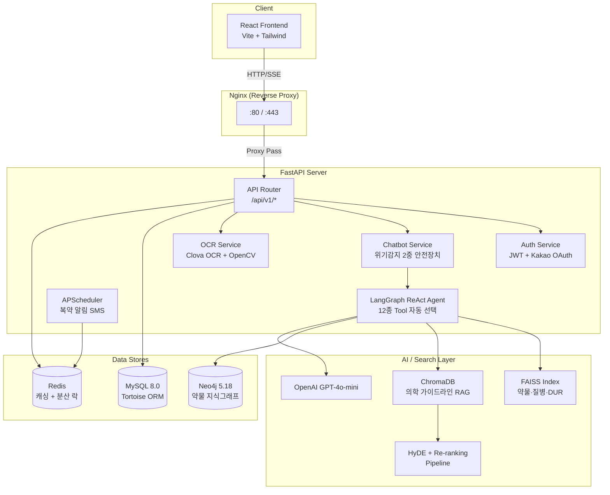

### 설계 의도

- **API 서버와 AI 검색 계층 분리**: FastAPI는 요청 라우팅·인증·비즈니스 로직만 담당하고, 약물 검색·RAG·지식그래프 조회는 별도 서비스 계층에서 처리합니다. LangGraph Agent가 12종 도구 중 질문 패턴에 맞는 도구를 자동 선택하므로, 새로운 데이터 소스 추가 시 Tool만 등록하면 됩니다.
- **다중 검색 엔진 조합**: FAISS(정형 약물 데이터), ChromaDB(비정형 가이드라인), Neo4j(관계형 상호작용)를 질문 유형에 따라 조합합니다. 단일 검색 엔진으로는 커버할 수 없는 약물 도메인의 다양한 질의 패턴을 처리하기 위한 구조입니다.
- **2중 안전장치**: 위기 표현은 Regex로 LLM 호출 전 즉시 차단하고, LLM 응답에서도 Structured Output으로 이중 검증합니다. 의료 도메인에서 안전성이 최우선이기 때문입니다.

---

## 설치 및 실행 방법

### 사전 요구사항

- Python 3.13+
- [uv](https://github.com/astral-sh/uv) (Python 패키지 매니저)
- Node.js 20+
- Docker & Docker Compose

### 1. 환경 변수 설정

```bash
# 로컬 개발용
cp envs/example.local.env envs/.local.env

# 프로덕션용
cp envs/example.prod.env envs/.prod.env
```

생성된 `.env` 파일에서 API 키와 DB 비밀번호를 실제 값으로 수정합니다. 상세 항목은 [환경 변수](#환경-변수) 섹션을 참고하세요.

### 2. Docker Compose로 전체 스택 실행 (권장)

```bash
# 루트에 .env 심볼릭 링크 생성
ln -sf envs/.local.env .env

# 전체 서비스 실행 (MySQL, Redis, Neo4j, FastAPI, Nginx)
docker compose up -d --build
```

실행 후 접속:

- API 문서 (Swagger UI): http://localhost/api/docs
- Neo4j 브라우저: http://localhost:7474

### 3. 로컬 개별 실행 (개발용)

```bash
# 의존성 설치
uv sync --group app --group dev

# FastAPI 서버
uv run uvicorn app.main:app --reload

# Frontend 개발 서버
cd frontend
npm ci
npm run dev
```

Frontend는 `http://localhost:5173`에서 실행되며, Vite 프록시 설정으로 `/api` 요청이 백엔드(`localhost:8000`)로 전달됩니다.

### 4. 데이터 초기화 (최초 1회)

세 스크립트는 **순서 및 의존 관계 없이 독립적으로 실행**할 수 있습니다.

```bash
# 의약품 마스터 데이터 적재 (소요 시간: 1분 내외)
uv run python scripts/seed_medicines.py

# DUR 데이터 임베딩 — FAISS 인덱스 생성 (소요 시간: 1분 내외)
uv run python scripts/embed_dur_files.py

# Neo4j 약물 지식그래프 시드 (소요 시간: 10초 내외)
uv run python scripts/seed_neo4j.py
```

> **스크립트를 실행하지 않거나 중간에 중단하면 어떻게 되나요?**
>
> - `seed_medicines.py` 미완료 시: MySQL `medicines` 테이블에 약품 데이터가 누락되어 약 검색 및 복용약 등록 시 검색 품질이 떨어집니다.
> - `embed_dur_files.py` 미완료 시: FAISS 인덱스가 불완전하게 생성되어 챗봇의 DUR 안전정보·약물 정보 답변 품질이 떨어집니다.
> - `seed_neo4j.py` 미완료 시: Neo4j 지식그래프가 비어 약물 상호작용 검사 기능이 동작하지 않습니다.

---

## 환경 변수

`envs/example.local.env` 기준 주요 항목입니다. 모든 외부 API 키는 빈 문자열일 경우 stub 모드로 동작합니다.

| 변수명                                          | 설명                                 | 기본값 / 예시                                      |
| ----------------------------------------------- | ------------------------------------ | -------------------------------------------------- |
| `ENV`                                           | 실행 환경 (`local` / `dev` / `prod`) | `local`                                            |
| `SECRET_KEY`                                    | JWT 서명 키                          | (필수)                                             |
| `DB_HOST`                                       | MySQL 호스트                         | `localhost` (Docker: `mysql`)                      |
| `DB_PORT`                                       | MySQL 포트                           | `3306`                                             |
| `DB_USER` / `DB_PASSWORD`                       | MySQL 인증 정보                      | `ozcoding` / `pw1234`                              |
| `DB_NAME`                                       | 데이터베이스명                       | `ai_health`                                        |
| `OPENAI_API_KEY`                                | OpenAI API 키 (LLM + 임베딩)         | (빈 값 시 stub)                                    |
| `OPENAI_MODEL`                                  | 사용할 GPT 모델                      | `gpt-4o-mini`                                      |
| `KAKAO_REST_API_KEY`                            | 카카오 OAuth REST API 키             | (빈 값 시 비활성)                                  |
| `KAKAO_CLIENT_SECRET`                           | 카카오 OAuth Client Secret           | (빈 값 시 비활성)                                  |
| `KAKAO_REDIRECT_URI`                            | 카카오 OAuth 콜백 URL                | `http://localhost:8000/api/v1/auth/kakao/callback` |
| `SOLAPI_API_KEY` / `SOLAPI_API_SECRET`          | Solapi SMS 인증 키                   | (빈 값 시 비활성)                                  |
| `OCR_PROVIDER`                                  | OCR 제공자 (`stub` / `clova`)        | `stub`                                             |
| `CLOVA_OCR_SECRET_KEY` / `CLOVA_OCR_INVOKE_URL` | Clova OCR 인증 정보                  | (빈 값 시 비활성)                                  |
| `MFDS_API_KEY`                                  | 식약처 e약은요 API 키                | (빈 값 시 stub)                                    |
| `MFDS_PILL_API_KEY`                             | 식약처 낱알식별 API 키               | (빈 값 시 stub)                                    |
| `FRONTEND_URL`                                  | 프론트엔드 URL (CORS)                | `http://localhost:5173`                            |

> **stub 모드란?** 외부 API 키가 없어도 서버가 기동되도록 더미 응답을 반환하는 모드입니다. OCR stub은 미리 정의된 샘플 파싱 결과를, LLM stub은 고정 텍스트를 반환합니다. 기능 개발 및 UI 테스트 시 실제 API 비용 없이 동작을 확인할 수 있습니다.

---

## API 엔드포인트

모든 API는 `/api/v1` prefix 하위에 위치합니다. 전체 스펙은 Swagger UI(`/api/docs`)에서 확인할 수 있습니다.

| 도메인      | 라우터              | 주요 기능                                        |
| ----------- | ------------------- | ------------------------------------------------ |
| 인증        | `/auth`             | 카카오 OAuth 로그인, JWT 발급/갱신, SMS 본인인증 |
| 사용자      | `/users`            | 프로필 조회/수정                                 |
| 챗봇        | `/chatbot`          | AI 약물 상담 (일반 응답 + SSE 스트리밍)          |
| 처방전 OCR  | `/ocr`              | 처방전 이미지 업로드 → 약품 자동 파싱            |
| 의약품      | `/medicines`        | 의약품 검색 (식약처 데이터 기반)                 |
| 복용약 관리 | `/user-medications` | 사용자 복용약 CRUD, 복용 스케줄 관리             |
| 복약 일정   | `/medications`      | 복약 체크, 복약 이력 조회                        |
| 캐릭터      | `/characters`       | 챗봇 페르소나 선택                               |
| 일기        | `/diaries`          | 건강 일기 작성/조회                              |
| 기분        | `/moods`            | 기분 기록/통계                                   |
| 진료 예약   | `/appointments`     | 진료 일정 관리                                   |
| 홈          | `/home`             | 대시보드 데이터                                  |

---

## 배포 아키텍처

프론트엔드와 백엔드는 **별도 레포지토리**로 분리되어 있습니다. 프론트엔드는 Vercel의 Git 연동 자동 배포를 활용하고, 백엔드는 AWS EC2에서 Docker Compose로 운영합니다.

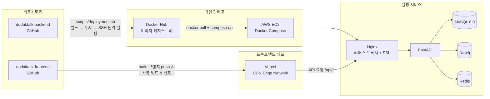

### 배포 흐름

**프론트엔드 (Vercel)**

`main` 브랜치에 push하면 Vercel이 자동으로 빌드·배포합니다. 별도의 배포 스크립트 없이 Git 연동만으로 운영됩니다.

**백엔드 (AWS EC2)**

```bash
# 1. Docker 이미지 빌드 & Docker Hub 푸시
# 2. SSH로 EC2 접속 후 최신 이미지 pull
# 3. docker compose up -d 로 컨테이너 교체
./scripts/deployment.sh
```

EC2에서는 Nginx가 SSL 종료와 리버스 프록시를 담당하고, FastAPI·MySQL·Neo4j·Redis가 Docker Compose 네트워크 안에서 통신합니다. SSL 인증서는 Certbot으로 자동 갱신됩니다.

### 환경별 접속 정보

| 환경     | 프론트엔드               | 백엔드 API                            |
| -------- | ------------------------ | ------------------------------------- |
| 로컬     | `http://localhost:5173`  | `http://localhost:8000`               |
| 프로덕션 | `https://dodactalk.site` | `https://api.dodactalk.site/api/docs` |

### 프로덕션 Docker Compose

```bash
# 프로덕션 환경 변수 설정
ln -sf envs/.prod.env .env

# 프로덕션 스택 실행 (Certbot SSL 포함)
docker compose -f docker-compose.prod.yml up -d
```

`docker-compose.prod.yml`은 로컬 개발용과 다음이 다릅니다:

- 소스 볼륨 마운트 없음 (이미지에 코드 포함)
- Certbot 컨테이너로 SSL 인증서 자동 갱신
- 443 포트 HTTPS 지원

### SSL 인증서 발급

```bash
chmod +x scripts/certbot.sh
./scripts/certbot.sh
```

---

## 트러블슈팅

개발 과정에서 실제로 겪은 문제와 해결 방법을 기록합니다.

### 인증 / 로그인

**카카오 로그인 무한 루프** (`fix/yoon-kakao-login-token`)

CORS·쿠키 설정 미스와 `TokenRefreshResponse` 처리 오류가 겹쳐 토큰 갱신이 무한 반복됐습니다. OAuth 콜백을 프론트엔드 페이지가 아닌 백엔드 redirect 방식으로 전환하고, JWT에서 직접 `user_id`를 추출하도록 변경해 불필요한 `/users/me` 호출을 제거했습니다.

**카카오 OAuth URL 파라미터 차단**

URL에 `access_token`이 포함되어 있을 때 `AuthRequired` 미들웨어가 이를 인증 실패로 판단해 차단하는 문제가 있었습니다. 콜백 경로에 대해 pass-through를 허용하여 해결했습니다.

---

### 복약 체크 / 메인 페이지

**복약 기록 서버 재시작 시 초기화** (`fix/yoon-medication-check-persist`)

복약 체크 상태를 메모리(in-memory dict)에 저장하고 있어 서버가 재시작되면 당일 기록이 전부 사라졌습니다. `MedicationLog` 테이블에 영속화하는 방식으로 전환했습니다.

**복약 슬라이드 높이 잘림 현상**

슬라이드 컴포넌트의 초기 높이를 마운트 직후 측정했는데, 콘텐츠가 완전히 렌더링되기 전에 측정되어 잘려 보이는 문제가 발생했습니다. 측정 타이밍을 `requestAnimationFrame` 이후로 보정해 해결했습니다.

**약 추가 후 복귀 시 복약 목록 미갱신**

약을 새로 추가하고 홈으로 돌아왔을 때 완료 배너 상태가 이전 값에 머물러 있었습니다. 페이지 포커스 복귀 시 재조회 로직을 추가해 해결했습니다.

---

### DB 마이그레이션 (Aerich)

팀 협업 환경에서 마이그레이션 충돌이 반복적으로 발생했습니다. 근본 원인은 **팀원 각자가 `aerich migrate`를 실행하면 타임스탬프 기반 파일명이 달라지고 `MODELS_STATE`가 어긋나는 것**이었습니다. 수동으로 파일을 작성할 때도 문제가 집중됐습니다.

| 커밋      | 문제                                                                                              | 해결                                                                    |
| --------- | ------------------------------------------------------------------------------------------------- | ----------------------------------------------------------------------- |
| `f573a5f` | 팀원 간 migration 파일 구조 충돌 — init 파일이 2개 존재하며 테이블 정의가 달랐음                  | migration 전면 재작성. `1_...` 파일을 주요 테이블 전체 CREATE로 교체    |
| `06f7c44` | `users.id` vs `users.user_id` FK 참조 불일치로 init migration이 실제 DB와 맞지 않음               | 전체 스키마가 담긴 단일 init 파일로 완전 교체 후 증분 migration만 유지  |
| `51d4a13` | `ADD COLUMN IF NOT EXISTS` 수동 작성 → MySQL 8.0 미지원 문법으로 syntax error                     | Aerich 자동 생성 방식(`ADD`/`DROP` without `IF EXISTS`)으로 파일 교체   |
| `657f920` | `DROP INDEX` → `DROP FK` 순서 오류 — MySQL은 FK가 있는 컬럼의 index를 FK 제거 전에 DROP할 수 없음 | downgrade 순서를 `DROP FK` → `DROP INDEX` → `DROP COLUMN` 순으로 재정렬 |

**공통 교훈**: Aerich migration은 자동 생성(`aerich migrate`)을 원칙으로 하고, 수동 작성은 최소화해야 합니다. 팀 협업 시에는 migration 파일을 한 명이 담당하거나, PR 병합 전 충돌 여부를 반드시 확인해야 합니다.

---

### 인프라 / 배포

**Nginx 413 오류**

처방전 이미지 업로드 시 `413 Request Entity Too Large` 에러가 발생했습니다. Nginx 기본 업로드 제한(1MB)이 처방전 이미지 크기를 초과했기 때문입니다. `client_max_body_size 10M` 설정으로 해결했습니다.

**Docker FastAPI 실행 불안정**

Docker 컨테이너 내에서 FastAPI가 간헐적으로 기동되지 않는 문제가 있었습니다. `uv run --no-sync` 옵션을 추가해 컨테이너 시작 시 불필요한 의존성 동기화를 건너뛰도록 해 안정화했습니다.

**asyncio 루프 충돌**

회원가입 요청 처리 중 비동기 루프 충돌이 발생해 `user_id` 저장에 실패하는 문제가 있었습니다. LangGraph Agent가 내부적으로 별도 루프를 사용하는 과정에서 충돌이 발생한 것으로, 이벤트 루프 참조를 명시적으로 관리하는 방식으로 해결했습니다.

---

### 프론트엔드

**다이어리 날짜 UTC/KST 불일치**

`today` 기준이 UTC로 처리되어 한국 시간 기준 자정 전후로 날짜가 하루씩 어긋나는 문제가 있었습니다. 날짜 계산 전반을 KST 기준으로 통일해 해결했습니다.

**코치마크 위치 오차**

온보딩 코치마크가 스텝 전환 시 대상 요소 위치에서 벗어나는 문제가 있었습니다. 스텝 전환 후 위치를 측정하는 타이밍이 레이아웃 계산 완료 전이었기 때문으로, `ResizeObserver`로 보정했습니다.

---

## 성능 지표

| 지표           | 값     | 비고                          |
| -------------- | ------ | ----------------------------- |
| Agent 타임아웃 | 60초   | `agent_service.py`            |
| Latency 로깅   | 활성화 | `main.py` — P95 측정 미들웨어 |


---

## 테스트 및 품질 관리

```bash
# 테스트 실행
./scripts/ci/run_test.sh

# 코드 포맷팅 검사 (Ruff)
./scripts/ci/code_fommatting.sh

# 정적 타입 검사 (Mypy)
./scripts/ci/check_mypy.sh
```

GitHub Actions CI가 `main`, `develop`, `release/*`, `hotfix/*` 브랜치에 대해 push/PR 시 Ruff lint + format check를 자동 실행합니다.

---

## 디렉토리 구조

```
.
├── app/                          # FastAPI 백엔드
│   ├── apis/v1/                  # API 라우터 (12개 도메인)
│   ├── core/                     # 설정 (pydantic-settings), 로거
│   ├── db/                       # Tortoise ORM 설정, Aerich 마이그레이션
│   ├── dependencies/             # FastAPI 의존성 (Redis, JWT 인증)
│   ├── dtos/                     # 요청/응답 DTO (Pydantic)
│   ├── models/                   # DB 테이블 정의 (11개 모델)
│   ├── repositories/             # 데이터 접근 계층
│   ├── schemas/                  # 내부 스키마 (LLM 응답 등)
│   ├── services/                 # 비즈니스 로직 (Agent, OCR, RAG, Graph 등)
│   ├── tests/                    # API 통합 테스트
│   ├── utils/                    # JWT, 보안 유틸리티
│   ├── validators/               # 입력 검증
│   ├── Dockerfile                # 백엔드 컨테이너 이미지
│   └── main.py                   # FastAPI 앱 진입점
├── frontend/                     # React 프론트엔드
│   ├── src/
│   │   ├── apis/                 # API 호출 함수
│   │   ├── assets/               # 이미지, 아이콘 등 정적 리소스
│   │   ├── components/           # UI 컴포넌트
│   │   ├── constants/            # 상수 정의 (캐릭터, 테마)
│   │   ├── context/              # React Context (채팅 등)
│   │   ├── hooks/                # 커스텀 훅
│   │   ├── pages/                # 페이지 컴포넌트
│   │   ├── router/               # React Router 설정
│   │   ├── store/                # Zustand 상태 관리
│   │   ├── types/                # TypeScript 타입 정의
│   │   └── utils/                # 유틸리티 함수
│   ├── Dockerfile                # 프론트엔드 빌드 이미지
│   └── package.json
├── docs/
│   └── images/                   # README 스크린샷
├── data/
│   ├── dur/                      # DUR 안전정보 CSV (8종)
│   ├── embeddings/               # ChromaDB 벡터 저장소
│   ├── faiss/                    # FAISS 인덱스 + 메타데이터
│   ├── guidelines/               # 의학 가이드라인 PDF (RAG 소스)
│   └── medicines/                # 식약처 의약품 원본 데이터
├── envs/                         # 환경 변수 파일
├── nginx/                        # Nginx 설정 (HTTP/HTTPS)
├── scripts/                      # 데이터 시드, 배포, CI 스크립트
├── tests/                        # 챗봇 엔진·안전장치 단위 테스트
├── .github/workflows/            # GitHub Actions CI
├── docker-compose.yml            # 로컬 개발용
├── docker-compose.prod.yml       # 프로덕션 배포용
└── pyproject.toml                # uv 의존성 관리
```

---

## 향후 개선 사항

- [ ] 프론트엔드 테스트 (Vitest + React Testing Library)
- [ ] GitHub Actions CI에 pytest + coverage 통합 (현재 주석 처리 상태)
- [ ] FAISS 인덱스 증분 업데이트 파이프라인
- [ ] Neo4j 지식그래프 자동 확장 (식약처 DUR 데이터 연동)
- [ ] 모니터링 대시보드 (Prometheus + Grafana)
- [ ] 다국어 지원 (영어 약물명 검색)
- [ ] RAG Re-ranking 정확도 개선율 측정 및 문서화
- [ ] OCR 파싱 성공률 측정 및 문서화

---

## 기여 방법

1. `develop` 브랜치에서 feature 브랜치를 생성합니다.
2. 커밋 메시지는 `.github/commit_template.txt`를 참고합니다.
3. PR 생성 시 `.github/PULL_REQUEST_TEMPLATE.md` 양식을 따릅니다.
4. CI 통과 후 코드 리뷰를 거쳐 머지합니다.

```bash
# 브랜치 생성
git checkout develop
git checkout -b feature/your-feature

# 커밋 템플릿 설정
git config commit.template .github/commit_template.txt
```
