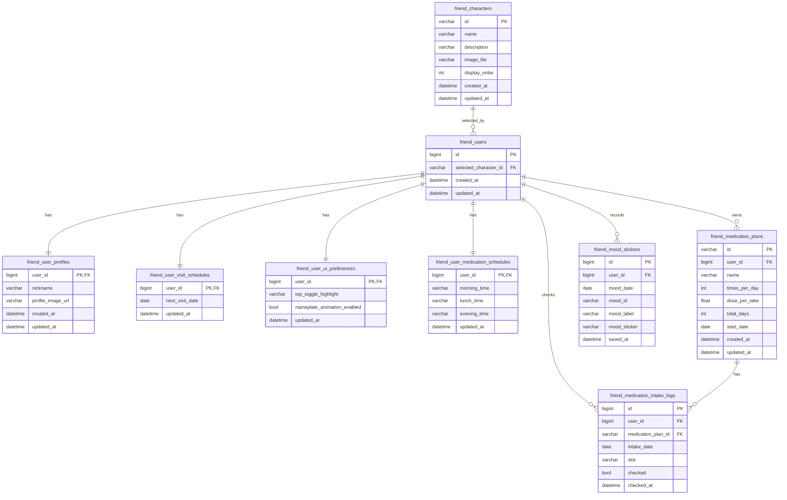

# Friend/Main Tortoise + MySQL ERD

`friend.py`, `main_screen.py`, `friend_db.py` 기준의 DB 구조입니다.

## 적용 개요

- ORM: Tortoise ORM
- DB: MySQL (`asyncmy`)
- 스키마 생성: `register_tortoise(..., generate_schemas=True)`
- 캐릭터 마스터 시드: 앱 시작 시 자동 upsert (`bootstrap_friend_data`)
- 기본 유저 부속 레코드 자동 생성: `ensure_friend_user`
- `main_screen.py` 프론트 상태 로직: **localStorage 의존 제거 완료**, DB API 기반으로 전환

## 핵심 저장 데이터

- 친구(캐릭터) 마스터
- 유저별 선택 친구(1명)
- 유저 프로필(닉네임, 프로필 이미지)
- 다음 진료일
- 메인 UI 설정(상단 토글 하이라이트, 이름표 애니메이션 ON/OFF)
- 복약 기준 시간(아침/점심/저녁)
- 복약 계획
- 복약 체크 로그
- 무드 스티커 로그(일 4개 제한은 API 레벨에서 검증)

## ERD (Mermaid)

## 파일 매핑

- DB 모델/초기화: `friend_db.py`
- 친구 선택/캐릭터 API: `friend.py`
- 메인 화면 + DB 연동 API(프로필/진료일/무드/복약/UI설정): `main_screen.py`

## DB 적용 완료 항목 (localStorage -> DB)

- 친구 선택/조회: `/api/v1/users/me/character`, `/api/v1/users/characters/*`
- 닉네임/프로필: `/api/v1/main/me/profile`
- 진료일(D-Day): `/api/v1/main/me/visit-schedule`
- 메인 UI 설정(상단 하이라이트, 이름표 애니메이션): `/api/v1/main/me/ui-preferences`
- 복약 기준 시간: `/api/v1/main/me/medication-schedule`
- 복약 계획: `/api/v1/main/me/medication-plans`
- 복약 체크 로그: `/api/v1/main/me/medication-intake`
- 무드 스티커/잔여 횟수: `/api/v1/main/me/mood-stickers`, `/api/v1/main/me/mood-stickers/remaining`

## 비고

- 사용자 식별은 `X-User-Id` 헤더로 처리
- 무드 스티커 일일 제한(4개)은 API 레벨에서 검증
